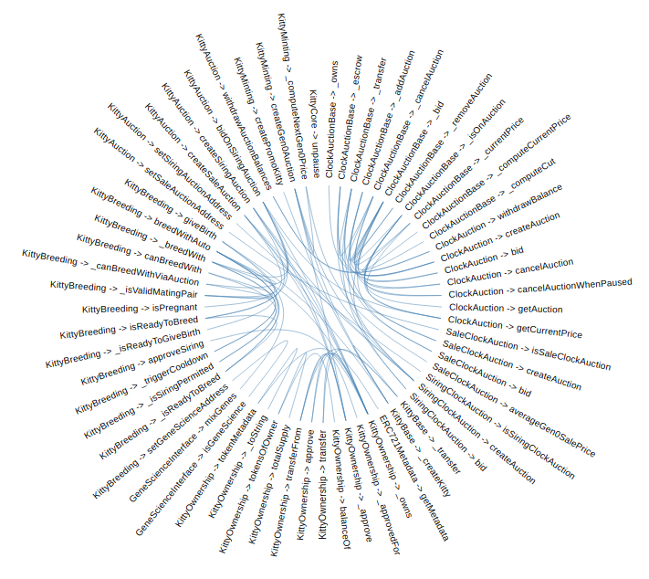

<div style="text-align:center">
    <h1>solviz</h1>
    <p>A visualization tool that makes Blockchain developers lives easier.</p>
    <p>Please, read our <a href="https://github.com/obernardovieira/solviz/wiki">wiki</a> to better understand the story and the algorithm.</p>
</div>
<p align="center">
    
</p>

## Features
* Two graphics (Hierarchical Edge Bundling and Force-Directed Graph) :nail_care:
* Interactive :beers:
* Really fast :rabbit2:

## Limitations
As it is still under development
* variables like: 0 and "some" directly in method
* assembly
* math actions as a parameter, like `function(variable - 1)`
* send a variable of same type but different scale as a method parameter, like send `uint32` instead of `uint256`
* cast in method, like `funtion(uint32(someVar))`
* a definition without variable name, like `getMetadata(uint256 _tokenId, string memory)`
* use a auto-generated 'get' from a public method, like `bool public isSaleClockAuction = true;`
* transfer in sub-methods, like `auction.bid.value(msg.value - fee)(_id);`

## Installation and usage

**NOTE**: Since there isn't any released version yet, the commands below doesn't work yet. To see the graphic of the image of to, you can run `npm run demo`.
We are hardly planning the release.

```bash
# Move to your project folder.
cd project-folder/

# Install solviz.
npm install --save-dev solviz

# Run solviz.
solviz Sample.sol

# View documentation
open ./docs/Sample.html
```

## Contributing
Pull requests are welcome. For major changes, please open an issue first to discuss what you would like to change.

Please make sure to update tests as appropriate.

## License
[GPL-3.0-only](LICENSE)
